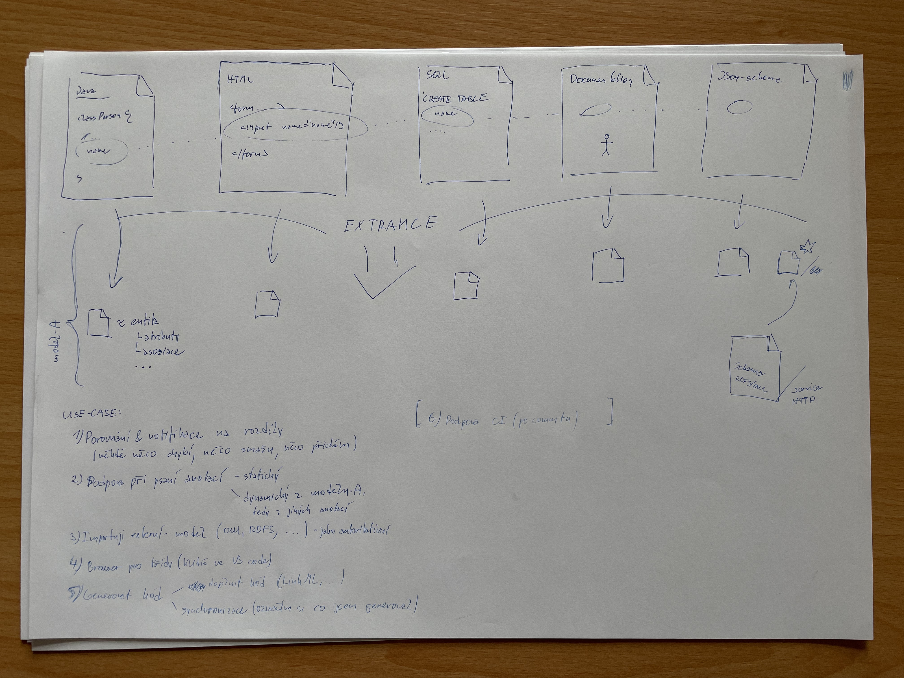
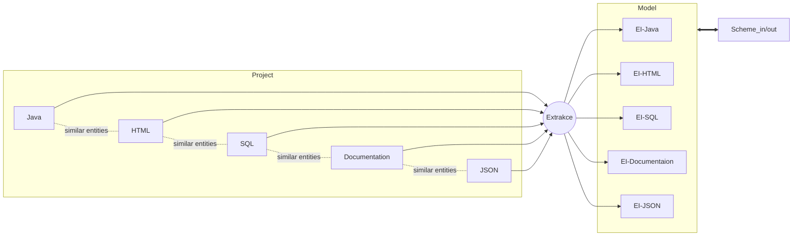
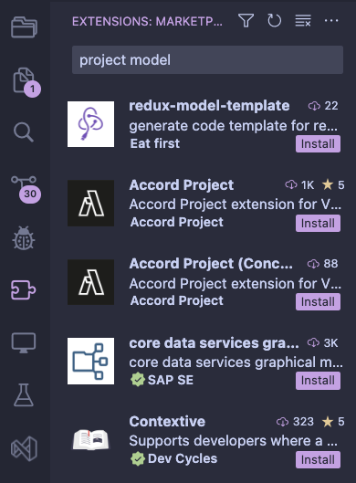
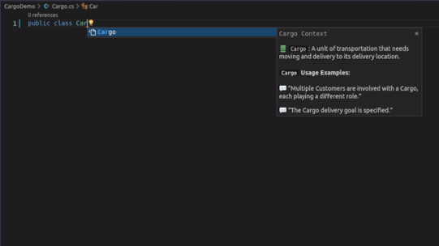
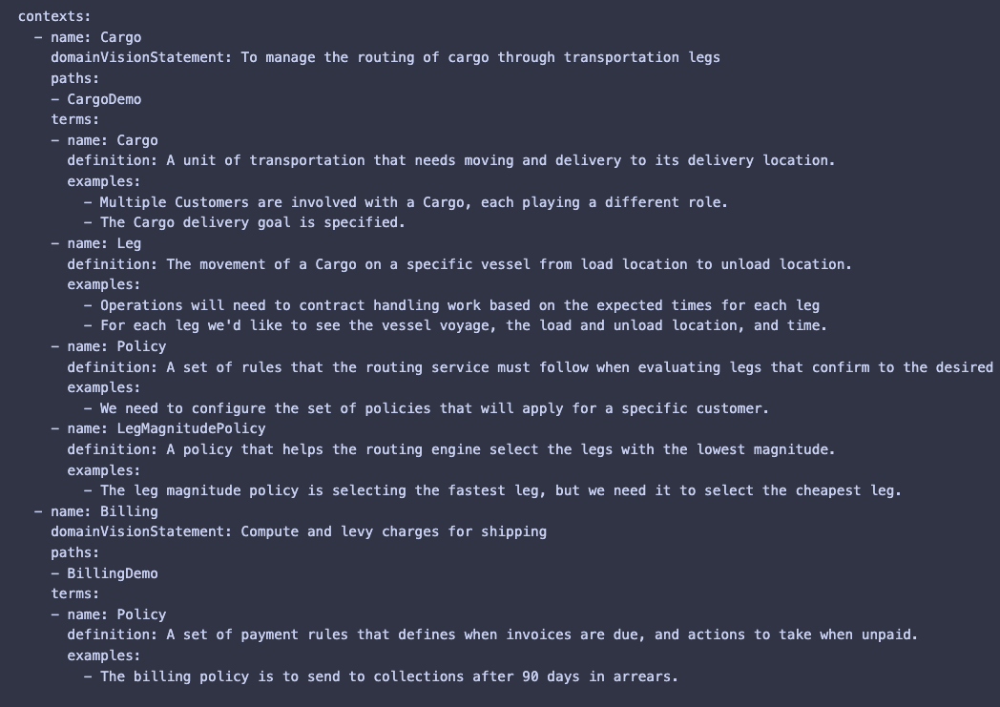

# Diary of the project

### Usefull links:

- [VSCode Extension Generator](https://www.npmjs.com/package/generator-code)
- [Publishing Extensions](https://code.visualstudio.com/api/working-with-extensions/publishing-extension)
- [VSCode API](https://code.visualstudio.com/api)
- [Examples of using VSCode API](https://github.com/microsoft/vscode-extension-samples)
- [Škoda Petr](https://skodapetr.github.io/)
- [Example of BACHELOR THESIS](https://dspace.cuni.cz/bitstream/handle/20.500.11956/174168/130333096.pdf?sequence=1&isAllowed=y)

# 24.03.2023 | Start of the project

> How to create plugin for VSCode? And with using external server for getting information about entities.

## Creating plugin

We need [Node.js](https://nodejs.org/en), [Yeoman](https://yeoman.io), [VS Code Extension Generator](https://www.npmjs.com/package/generator-code)

```shell
npm install -g yo generator-code # installing
yo code # create sample
```

```
Structure of the project:
.
├── .vscode
│   ├── launch.json     // Config for launching and debugging the extension
│   └── tasks.json      // Config for build task that compiles TypeScript
├── .gitignore          // Ignore build output and node_modules
├── README.md           // Readable description of your extension's functionality
├── src
│   └── extension.ts    // Extension source code
├── test                // Extension tests
├── package.json        // Extension manifest
├── tsconfig.json       // TypeScript configuration
```

## Publishing

**Note:** Due to security concerns, vsce will not publish extensions that contain user-provided SVG images.

**Requirements:**
[vsce](https://github.com/microsoft/vscode-vsce) - short for "Visual Studio Code Extensions", is a command-line tool for packaging, publishing and managing VS Code extensions.
`npm install -g @vscode/vsce`

```shell
$ cd myExtension
$ vsce package # myExtension.vsix generated
$ vsce publish # <publisherID>.myExtension published to VS Code Marketplace

```

# 12.04.2023 | Basic functionality for plugin

> **Do basic functionality for plugin suppotring:**
>
> - marking of classes, methods, and atributes
> - suggesting/hints when identifying existing entities (maybe auto-writing like in Copilot)
> - showing of information about marked element
> - showing errors

- I came up with a name the extension: `Entity-Inspector`

## Implementaion

### General information

Vscode has an [API](https://code.visualstudio.com/api) for creating plugins. <br>
There are 2 ways to implement the functionality of the plugin: [Language Server](https://code.visualstudio.com/api/language-extensions/language-server-extension-guide) and [Language Features](https://code.visualstudio.com/api/language-extensions/language-features). <br>
I used the second way, because it is easier to implement and it is enough for my task.

Also there is usefull link to examples of using VSCode API: [vscode-extension-samples](https://github.com/microsoft/vscode-extension-samples)

I used _register provider_ methods for implementing functionality:

`registerCompletionItemProvider` - for marking elements of entityes <br>
`registerInlineCompletionItemProvider` - for suggesting/hints when identifying existing entities (maybe auto-writing like in Copilot) <br>
`registerHoverProvider` - for showing of information about marked element <br>
`diagnosticCollection` - for showing errors

Each of this methods takes 2 main arguments:

- `selector` - is a [DocumentSelector](https://code.visualstudio.com/api/references/vscode-api#DocumentSelector) which is either a [language id](https://code.visualstudio.com/api/references/vscode-api#languages.getLanguages), like `javascript`, or a more complex [filter](https://code.visualstudio.com/api/references/vscode-api#DocumentFilter) like `{ language: 'typescript', scheme: 'file' }`.

- `provider` - An object that implements [completion item provider](https://code.visualstudio.com/api/references/vscode-api#CompletionItemProvider) interface.

---

### Marking (Ctrl+Space)


I used special syntax for marking elements of entityes `@ei-<type>` in comments.

I used `registerCompletionItemProvider` for marking elements of entityes:

- This method is called when the user **types a character or presses `Ctrl+Space`** in the editor.
- The method should return a list of completion items ([CompletionList](https://code.visualstudio.com/api/references/vscode-api#CompletionList))
- Completion items are presented in the IntelliSense UI. Depending on the [kind](https://code.visualstudio.com/api/references/vscode-api#CompletionItemKind) of completion item, VS Code shows icon and/or text.
  - The `label` property is mandatory. It is presented in the IntelliSense UI and can be used to filter the list of completion items.
  - The `insertText` property is optional. If it is omitted, the `label` is inserted. If it is set to `null`, nothing is inserted when the completion item is accepted.
  - The `documentation` property is optional. It is shown in the IntelliSense UI when hovering over the completion item.
  - The `kind` property is optional. It is used to set the icon in the IntelliSense UI.

```ts
registerCompletionItemProvider (
    selector: DocumentSelector, // where to use this provider
    provider: DocumentFormattingEditProvider // what to do when provider is called
    triggerCharacters?: string[] // when to call provider (optional)
    ): Disposable
```

_Note:_ I used:`{pattern: "**"}` for _selector_ and `@ei-` for _triggerCharacters_ for using this provider in all files and for calling it when user press `Ctrl+Space`.

### Suggesting/hints when identifying existing entities


I found existing example of using this functionality in some open source project: [copilot-clone](https://github.com/hieunc229/copilot-clone/blob/master/src/extension.ts)

I used `registerInlineCompletionItemProvider` for suggesting/hints when identifying existing entities:

- This method works same as `registerCompletionItemProvider` but it is called when the user **types a character** in the editor and it is used for **inline** completion - when the user is typing and the editor is showing suggestions at the cursor.

```ts
registerInlineCompletionItemProvider (
    selector: DocumentSelector, // where to use this provider
    provider: DocumentFormattingEditProvider // what to do when provider is called
    triggerCharacters?: string[] // when to call provider (optional)
    ): Disposable
```

### Showing of information about marked element

We can use `registerHoverProvider` for showing of information about marked element:

- This method is called when the user **hovers over a symbol** in the editor.
- The method should return a [hover](https://code.visualstudio.com/api/references/vscode-api#Hover) or a [thenable](https://code.visualstudio.com/api/references/vscode-api#Thenable) that resolves to such.

```ts
registerHoverProvider (
    selector: DocumentSelector, // where to use this provider
    provider: DocumentFormattingEditProvider // what to do when provider is called
    ): Disposable
```

### Showing errors


I used `diagnosticCollection` for showing errors. That is a collection of diagnostics, such as errors or warnings, that belong to a source. <br>

# 26.04.2023 | Fetching, memorization, motivation

> - I will think about how to fetch data from server in extension and how to show it to user. <br>
> - I need to do data memorization <br>
> - I will think about what motivates me to do this plugin.<br>
> - I have to finish the previous tasks

### Fetching data from server

I think that I will use [fetch](https://developer.mozilla.org/en-US/docs/Web/API/Fetch_API/Using_Fetch) for fetching data from server. <br>

```ts
// This is an example of using fetch
fetch("https://api.github.com/users/github")
  .then((response) => response.json())
  .then((data) => console.log(data));
```

### Data memorization

I think that I _parse_ data from workspace and I will memorize it in cache like `Map<string, EIClass>` where `string` is a path to file and `EIClass` is a class that contains information about entity. <br>
Also we can memorize data in file, but I think that it is not a good idea, becouse we don't wont to create files in workspace.

```ts
class EIClass {
  name: string;
  fromFile: vscode.Uri;
  // name of the atributes and methods
  atributes: string[];
  methods: string[];
}
```

### Motivation

Firstly, as software developers, our main goal is to write code efficiently. We spend a lot of time reading, analyzing, and understanding code, and this can be a daunting task, especially when we are dealing with large codebases. The Entity Inspector extension aims to simplify this process by allowing developers to see all the entities in one place, making it easier to navigate through the codebase and find the information they need faster.

Secondly, the Entity Inspector extension provides a convenient way to manage entities. It enables developers to automatically generate an entity if they already have one in their code, saving them time and effort. Additionally, the plugin can hint about existing entities, making it easier to reuse code and avoid duplicating work.

Finally, the Entity Inspector extension promotes organization in code. It allows developers to see all the information about an entity in one place, making it easier to understand its purpose and function. This can lead to more maintainable code and better collaboration among team members.

In summary, the Entity Inspector extension for VSCode provides an efficient, convenient, and organized way to manage entities in code, ultimately making the development process smoother and more productive.

> TODO: Think about vscode configs and how to use them in extension.

# 17.05.2023 | Model and use cases of extension



### Creating a model of EI


Some example of modeling data: [LinkML - Linked data Modeling Language (model your data)](https://linkml.io/)

**There are 2 ways how to create a model of EI:** <br>
	1. Parse project and create small (?)files with only with entities. After that create a model of EI by comparing small files (and you can also create a scheme of Entities) <br>
	2. Upload a scheme and create a model of EI

### Use cases

1. Comparing & validating (somewhere something is missing, something needs to be removed, something added)
2. Help when writing annotations (**static** like lince or **dynamic** like copilot using a model of EI)
3. Import/export existing entities (from another project(server) or from scheme)
4. Browser for entities in vscode like a preview of .md files (searching, filtering, sorting, grouping, etc.)
5. Generating code ([generating code with linkML](https://linkml.io/linkml/generators/index.html))
	- Synhronization of entities (from project or from scheme and define there is a genetaion of code)
6. Help with CI/CD github actions (for example: check if there is a new version of scheme and if yes, then generate code)

> TODOs for this time:
> - TODO: Start writing Bachelor Thesis (related work):
> 	- Are there any similar extensions? If yes, what are they doing? What are their advantages and disadvantages? Comparing with some code helpers (copilot, lince, etc.), with ChatGPT. Compare with other tools for creating models (LinkML, etc.).

---

During this time I was thinking about how to create a model of EI and I found a tool called [LinkML](https://linkml.io/). It is a tool for creating models of data. I think that I will use it for work with a model of EI. <br>
I wrote an introduction to my bachelor thesis and I started writing a related work. And also I was thinking about use cases of EI and content of my bachelor thesis.


# 07.06.2023 | Related work

## Approximate sylabus of the Bc. work

~50 pages

- Related work 
	- Are there any similar extensions? 
	- If yes, what are they doing? 
	- What are their advantages and disadvantages? 
	- Comparing with some code helpers (copilot, lince, etc.), with ChatGPT. Compare with other tools for creating models (LinkML, etc.).
- Analyza 
	- What is the problem? What is the goal? 
	- What is the solution? What is the benefit?
- Design 
	- How to solve the problem? 
	- What is the architecture, design, model?
- implementace 
	- How to implement the solution? What is the implementation? What is the model? (programmers doc)
- User doc 
	- How to use the extension? 
	- How to install? 
	- How to configure? 
	- How to extend?
- ? Administators doc
	- How to install? 
	- How to configure?
- Evaluation 
	- Show the results of the extension. Use cases. Peoples reactions (interviews, etc.)
- Conclusion 
	- What is the result? What is the benefit? What is the future work?

## TODOs for this time:
- TODO: Start writing related work in bachelor thesis
- TODO: Start implementing EI extension

## Related work

## Keywords and phrases:
- Visual Studio Code extensions
- Software development productivity tools
- Development workflow management
- Software project management
- Local Code Generator Tool
- Static code analysis
- Project analyzer
- Model of project
- Code analysis
- Code helpe

### Queries

**15.06.2023 | Local Code Generator Tool | google search**
- first 20 results
- filtration criteria: 
	- it is a vscode extension
	- it is a code helper/code generator/code analyzer
	- it is a project analyzer
	- there is a code suggestion
- found:
	- [Oasis](https://github.com/ChuloAI/oasis)
	- [GitHub Copilot · Your AI pair programmer](https://github.com/features/copilot)	
	- [AI assistant for software developers | Tabnine](https://www.tabnine.com/)
	- [IntelliSense in Visual Studio Code](https://code.visualstudio.com/docs/editor/intellisense)

**25.06.2023 | project model | vscode marketplace**
- first 30 results
- filtration criteria: 
	- it is a vscode extension
	- it is a code helper/code generator/code analyzer
	- it is a project analyzer
	- there is a code suggestion
- found:
	- [Contextive](https://marketplace.visualstudio.com/items?itemName=devcycles.contextive)


**25.06.2023 | development workflow management vscode extension | google search**
- First 20 results
- filtration criteria: 
	- it is a vscode extension
	- it is a project analyzer
- found:
	- [Visual Assist](https://marketplace.visualstudio.com/items?itemName=WholeTomatoSoftware.VisualAssist)
	- [IntelliCode](https://marketplace.visualstudio.com/items?itemName=VisualStudioExptTeam.vscodeintellicode)

**25.06.2023 | static code analysis vscode | google search**
- First 20 results
- filtration criteria: 
	- it is a vscode extension
	- it is a code helper/code generator/code analyzer
	- it is a project analyzer
- found:
	- [Codiga - Static Code Analysis for VisualStudio](https://www.codiga.io/static-code-analysis/vscode/)

**25.06.2023 | Entity inspector | google search**
- First 20 results
- filtration criteria: 
	- it is a project analyzer
- found:

## About findings

### evaluation criteria:
- It is a vscode extension
- It is a code helper/generator/analyzer
- It is a project analyzer
- There is a code suggestion
- Available for free
- It is open source
- It is a local tool

### Marking:

(X - not, √ - yes, - partialy yes, ? - not sure)

### 1. [oasis](https://github.com/ChuloAI/oasis)
[Post about it](https://betterprogramming.pub/building-oasis-a-local-code-generator-tool-using-open-source-models-and-microsofts-guidance-aef54c3e2840)

A Local Code Generator Tool Using Open Source Models and Microsoft’s Guidance Library.
The plugin uses a local model to generate code with promts

The idea is generate code with the assistance of guidance library, using open source LLM models that run locally. This library is exposed as a VSCode plugin, and adds code-generation commands on editor selection (invoked through right-click or command palette).

It is free and open source. This is under development

How it works:
- You can select a code and generate a code with the assistance of guidance library
- You can add self-written commands for generating code
- Actually, it is a code generator that uses a local model for generating code

### 2. [copilot](https://copilot.github.com/) - AI pair programmer

It is a tool for generating code with the assistance of AI. GitHub Copilot uses the OpenAI Codex to suggest code and entire functions in real-time, right from your editor. OpenAI Codex is a descendant of GPT-3 and has been trained on a selection of public source code repositories. GitHub Copilot works with a broad set of frameworks and languages, including Python, JavaScript, TypeScript, Ruby, and Go, and is trained on billions of lines of public code.

It is paid and closed source.

How it works:
- You can write a comment and copilot will write a code for you
- Copilot can suggest a code for you
- Copilot is trained on billions of lines of public code
- You can ask copilot right in chat in the sidebar

### 3. [TabNine](https://www.tabnine.com/) - AI code completion like copilot

It is a tool for generating code with the assistance of AI like copilot. TabNine is an autocompleter that helps you write code faster. They are using machine learning to train TabNine on millions of files from open-source projects. TabNine is trained on 2 million files from GitHub and is adding more each day.

It is paid and closed source.

### 4. [intellisense](https://code.visualstudio.com/docs/editor/intellisense)

IntelliSense is a general term for various code editing features including: code completion, parameter info, quick info, and member lists. IntelliSense features are sometimes called by other names such as "code completion", "content assist", and "code hinting."

It is free tool in vscode.

How it works:
- You can see suggestions in the code
- You can see info about the code

### 5. [contextive](https://github.com/dev-cycles/contextive) - context visualization for vscode





It is a tool for context definition in the project.
Contextive is inspired by the concept of the Ubiquitous Language from the practice of Domain Driven Design (DDD) and is intended to support ubiquitous language management practices on DDD projects.

By defining terms in a central definitions file, Contextive can surface definitions and usage examples in auto-complete suggestions & hover panels wherever the terms are used - in code (of any language across the stack), comments, config, and documentation (e.g. markdown, yaml, etc).

It is free and open source. This is under development

How it works:
- You can define a context ("vision", "usage examples", "description") in the project in special directory (.contextive) to yaml file (definition.yaml)
- After that you can use this context in the project and you can see info about it with suggestions in the code and IntelliSense.

### 6. [Visual Assist](https://marketplace.visualstudio.com/items?itemName=WholeTomatoSoftware.VisualAssist)

It is a tool for generating code with the assistance of AI like copilot. Visual Assist is a Visual Studio extension - a productivity tool for refactoring, reading, writing, navigating and generating C / C++ / C# code.

It is paid and closed source.

How it works:
- It allows you to generate code 
- It allows you to navigate in the code
- It allows you to refactor the code

### 7. [IntelliCode](https://marketplace.visualstudio.com/items?itemName=VisualStudioExptTeam.vscodeintellicode)

This extension provides AI-assisted IntelliSense by showing recommended completion items for your code context at the top of the completions list. When it comes to overloads, rather than taking the time to cycle through the alphabetical list of member, IntelliCode presents the most relevant one first. 

It is free and open source.


### 8. [Codiga](https://www.codiga.io/static-code-analysis/vscode/) - Static Code Analysis for VisualStudio

It is a tool for static code analysis. Codiga is a static code analysis tool that helps developers write better code. It is a Visual Studio Code extension that provides real-time feedback on code quality, security, and performance issues.

It is paid and closed source.

! But is not available now

### Other tools

#### [LinkML](https://linkml.io/) - Linked data Modeling Language (model your data)
DATE: 15.06.2023

It is a tool for modeling data. LinkML is a modeling language for describing data models. It is a YAML-based language that is easy to read and write, and is designed to be easy to learn and use. 

It is free and open source.

How it works:
- You can create a model of data in yaml file
- You can generate code from this model
- You can validate your data with this model
- You can create a scheme from this model

# 29.06.2023

- Questions
	- how many search results should I check?
	- To say exactly how the user will use it
	- If the project is large enough, it will be quite difficult and long to parse the project (however, you can not parse the entire project every time, but there are many conditions for this and a lot of bugs:
		*how it store*,
		*how it is structured*,
		*parsing only on save | on change | on command*,
		*collision* - if extension parse one file,but user already changed another file or smth like that,
	- Using json or yaml model?
		- json: it is more difficult to write, but it is easier to parse
		- yaml: it is easier to write, but it is more difficult to parse
	- I like a contextive extension, but it is not a code generator, it is a code helper. Entities are not defined in different files, but are defined separately in yaml files and then you can view the context of the project according to the words in Intellisenses.