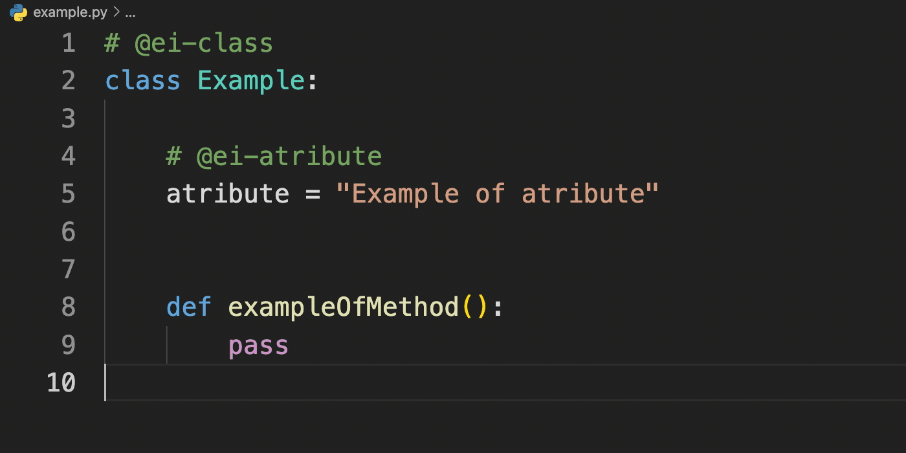
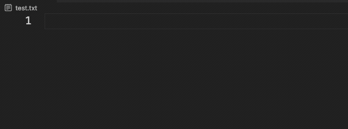
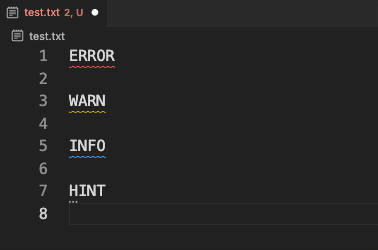

# Diary of the project

### Usefull links:

- [VSCode Extension Generator](https://www.npmjs.com/package/generator-code)
- [Publishing Extensions](https://code.visualstudio.com/api/working-with-extensions/publishing-extension)
- [VSCode API](https://code.visualstudio.com/api)
- [Examples of using VSCode API](https://github.com/microsoft/vscode-extension-samples)

# 24.03.2023 | Start of the project

> How to create plugin for VSCode? And with using external server for getting information about entities.

## Creating plugin

We need [Node.js](https://nodejs.org/en), [Yeoman](https://yeoman.io), [VS Code Extension Generator](https://www.npmjs.com/package/generator-code)

```shell
npm install -g yo generator-code # installing
yo code # create sample
```

```
Structure of the project:
.
├── .vscode
│   ├── launch.json     // Config for launching and debugging the extension
│   └── tasks.json      // Config for build task that compiles TypeScript
├── .gitignore          // Ignore build output and node_modules
├── README.md           // Readable description of your extension's functionality
├── src
│   └── extension.ts    // Extension source code
├── test                // Extension tests
├── package.json        // Extension manifest
├── tsconfig.json       // TypeScript configuration
```

## Publishing

**Note:** Due to security concerns, vsce will not publish extensions that contain user-provided SVG images.

**Requirements:**
[vsce](https://github.com/microsoft/vscode-vsce) - short for "Visual Studio Code Extensions", is a command-line tool for packaging, publishing and managing VS Code extensions.
`npm install -g @vscode/vsce`

```shell
$ cd myExtension
$ vsce package # myExtension.vsix generated
$ vsce publish # <publisherID>.myExtension published to VS Code Marketplace

```

# 12.04.2023 | Basic functionality for plugin

> **Do basic functionality for plugin suppotring:**
>
> - marking of classes, methods, and atributes
> - suggesting/hints when identifying existing entities (maybe auto-writing like in Copilot)
> - showing of information about marked element
> - showing errors

- I came up with a name the extension: `Entity-Inspector`

## Implementaion

### General information

Vscode has an [API](https://code.visualstudio.com/api) for creating plugins. <br>
There are 2 ways to implement the functionality of the plugin: [Language Server](https://code.visualstudio.com/api/language-extensions/language-server-extension-guide) and [Language Features](https://code.visualstudio.com/api/language-extensions/language-features). <br>
I used the second way, because it is easier to implement and it is enough for my task.

Also there is usefull link to examples of using VSCode API: [vscode-extension-samples](https://github.com/microsoft/vscode-extension-samples)

I used _register provider_ methods for implementing functionality:

`registerCompletionItemProvider` - for marking elements of entityes <br>
`registerInlineCompletionItemProvider` - for suggesting/hints when identifying existing entities (maybe auto-writing like in Copilot) <br>
`registerHoverProvider` - for showing of information about marked element <br>
`registerCodeActionsProvider` - for showing errors

Each of this methods takes 2 main arguments:

- `selector` - is a [DocumentSelector](https://code.visualstudio.com/api/references/vscode-api#DocumentSelector) which is either a [language id](https://code.visualstudio.com/api/references/vscode-api#languages.getLanguages), like `javascript`, or a more complex [filter](https://code.visualstudio.com/api/references/vscode-api#DocumentFilter) like `{ language: 'typescript', scheme: 'file' }`.

- `provider` - An object that implements [completion item provider](https://code.visualstudio.com/api/references/vscode-api#CompletionItemProvider) interface.

---

### Marking (Ctrl+Space)



I used special syntax for marking elements of entityes `@ei-<type>` in comments.

I used `registerCompletionItemProvider` for marking elements of entityes:

- This method is called when the user **types a character or presses `Ctrl+Space`** in the editor.
- The method should return a list of completion items ([CompletionList](https://code.visualstudio.com/api/references/vscode-api#CompletionList))
- Completion items are presented in the IntelliSense UI. Depending on the [kind](https://code.visualstudio.com/api/references/vscode-api#CompletionItemKind) of completion item, VS Code shows icon and/or text.
  - The `label` property is mandatory. It is presented in the IntelliSense UI and can be used to filter the list of completion items.
  - The `insertText` property is optional. If it is omitted, the `label` is inserted. If it is set to `null`, nothing is inserted when the completion item is accepted.
  - The `documentation` property is optional. It is shown in the IntelliSense UI when hovering over the completion item.
  - The `kind` property is optional. It is used to set the icon in the IntelliSense UI.

```ts
registerCompletionItemProvider (
    selector: DocumentSelector, // where to use this provider
    provider: DocumentFormattingEditProvider // what to do when provider is called
    triggerCharacters?: string[] // when to call provider (optional)
    ): Disposable
```

_Note:_ I used:`{pattern: "**"}` for _selector_ and `@ei-` for _triggerCharacters_ for using this provider in all files and for calling it when user press `Ctrl+Space`.

### Suggesting/hints when identifying existing entities



I found existing example of using this functionality in some open source project: [copilot-clone](https://github.com/hieunc229/copilot-clone/blob/master/src/extension.ts)

I used `registerInlineCompletionItemProvider` for suggesting/hints when identifying existing entities:

- This method works same as `registerCompletionItemProvider` but it is called when the user **types a character** in the editor and it is used for **inline** completion - when the user is typing and the editor is showing suggestions at the cursor.

```ts
registerInlineCompletionItemProvider (
    selector: DocumentSelector, // where to use this provider
    provider: DocumentFormattingEditProvider // what to do when provider is called
    triggerCharacters?: string[] // when to call provider (optional)
    ): Disposable
```

### Showing of information about marked element

We can use `registerHoverProvider` for showing of information about marked element:

- This method is called when the user **hovers over a symbol** in the editor.
- The method should return a [hover](https://code.visualstudio.com/api/references/vscode-api#Hover) or a [thenable](https://code.visualstudio.com/api/references/vscode-api#Thenable) that resolves to such.

```ts
registerHoverProvider (
    selector: DocumentSelector, // where to use this provider
    provider: DocumentFormattingEditProvider // what to do when provider is called
    ): Disposable
```

### Showing errors



I used `registerCodeActionsProvider` for showing errors:

> TODO:
>
> 1.  add gifs for each functionality
> 2.  add description for showing errors functionality

# 26.04.2021 | Fetching data from server and motivation for plugin

> This week I will think about how to fetch data from server in extension and how to show it to user. And I need to do memorization of data <br>
> Also I will think about what motivates me to do this plugin.

### Motivation

I think that this plugin will be useful for developers, because it will help them to understand code faster and easier. <br>
Also I think that this plugin will be useful for me, because I will learn how to create plugins for VSCode and I will learn how to use VSCode API.
